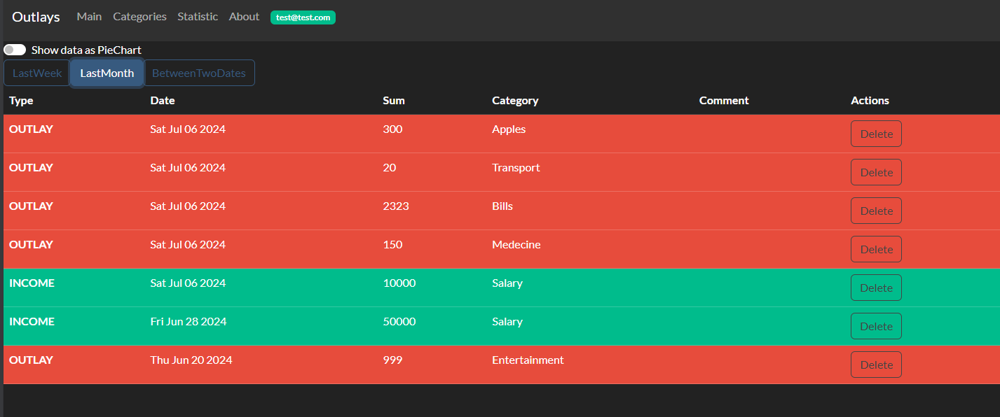
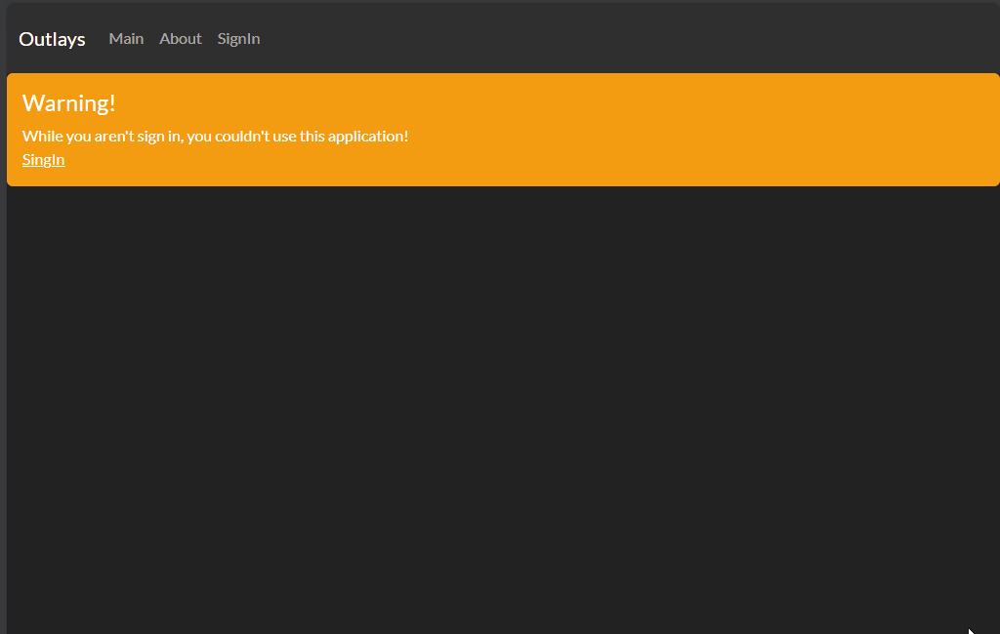
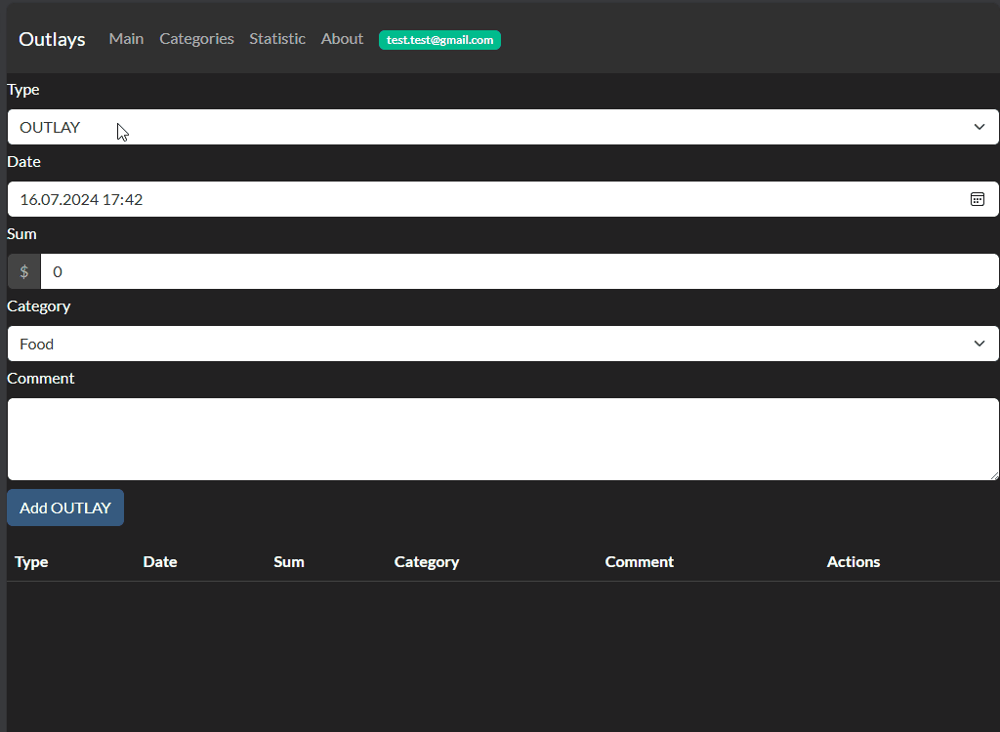
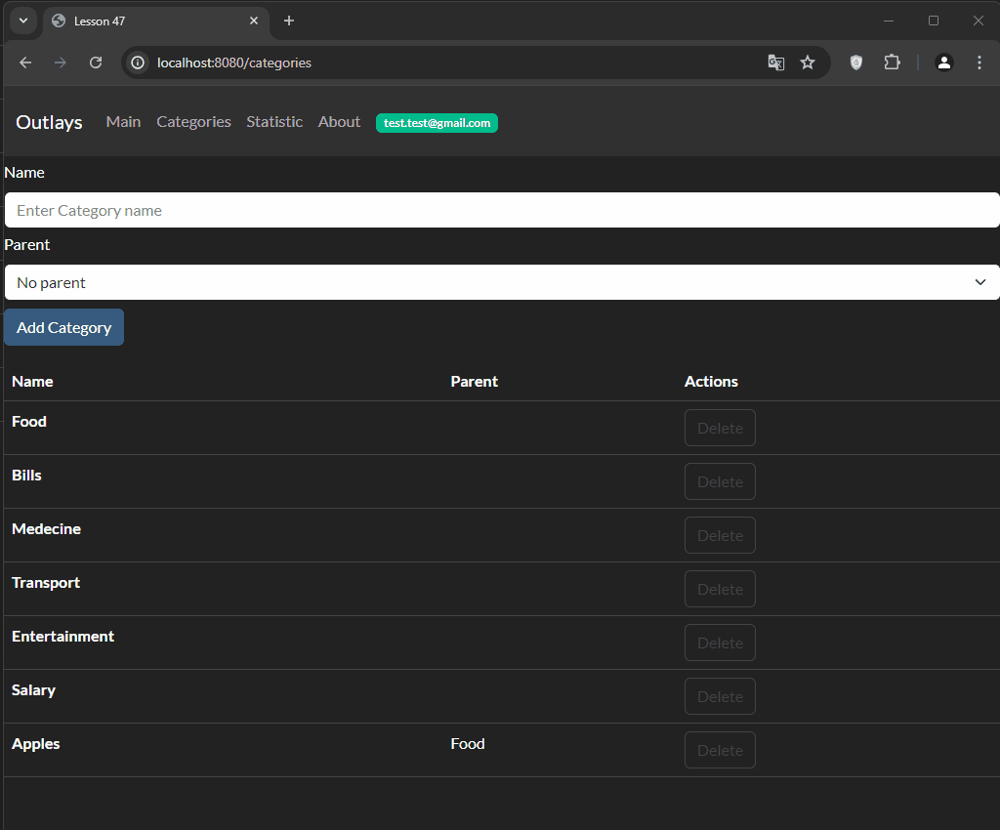
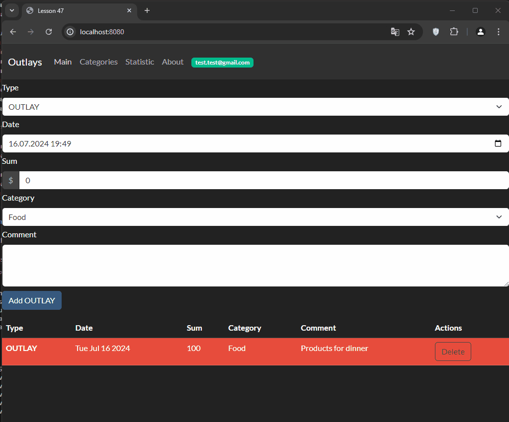

<br/>
<p align="center">
  <h3 align="center">OUTLAYS</h3>
  <p align="center">
    React приложение позволяющее каждому пользователю вести записи рассходов и доходов, распределенных по категориям и времени.
    <br/>
    <br/>
  </p>
</p>

[](https://github.com/SergeyAkkuratov/OTUS_homework_lesson47/actions/workflows/pull_request_check.yml)
 


## Содержание

-   [О проекте](#о-проекте)
-   [Установка](#установка)
-   [Использование](#использование)
-   [Структура проекта](#структура-проекта)

## О проекте



Приложение OUTLAYS служит для осознаных трат и планирования бюджета путём записи всех рассходов и доходов пользователя и предоставления статистики по заданным параметрам.

## Требования

Для локального запуска приложения вам потребуется [npm](https://docs.npmjs.com/downloading-and-installing-node-js-and-npm).

## Установка

Для локального запуска приложения вам нужно склонировать проект, скачать зависимости и скрипт запуска:

```bash
git clone https://github.com/SergeyAkkuratov/OTUS_homework_lesson47.git ./outlays

cd ./outlays

npm install

npm start

```

Приложение будет доступно по адресу http://localhost:8080/.

Приложение OUTLAYS требуется для своей работы подключения React-Redux и React-Router, поэтому если вы хотите встроить его в своё приложение вам нужно использовать компонент App (и все его зависимости) и обернуть его в компонент Provider (React-Redux) и компонент Router (React-Router).

Например:

```typescript
<>
    <Provider store={store}>
        <BrowserRouter basename={PREFIX}>
            <App />
        </BrowserRouter>
    </Provider>
</>
```

Так же попробовать приложение можно [онлайн](https://sergeyakkuratov.github.io/OTUS_homework_lesson47/).

## Использование

1. Регистрация пользоваеля  
   Для использования приложения требуется иметь зарегестрировать пользователя.  
   Для этого нужно:

    - перейти на страницу "SingIn"
    - ввести желаемый emil (он будет использоваться как логин) и пароль
    - нажать кнопку "Sign up"

    В результате будет создан новый пользователь и автоматически осуществлён вход в приложение.

    

1. Авторизация существующим пользователем
   Если пользователь уже был создан, ту на той же странице "SignIn" осуществляется вход.  
   Для этого нужно:

    - перейти на страницу "SingIn"
    - ввести желаемый emil (он будет использоваться как логин) и пароль
    - нажать кнопку "Sign in" или нажать Enter

1. Главная страница
   После авторизации пользователя открывается главная страница. Так же она доступна по кнопке "Main".  
   На ней пользователь может добавлять новые расходы и доходы, а так же видеть таблицу, содержащую записи за последнюю неделю.  
   В таблице записи можно удалить (таким образом осуществеляется редактирование записей).  
   Для добавления записи нужно:

    - перейти на страницу "Main"
    - заполнить все имеющиеся поля (поля "Comment" может оставаться пустым)
    - нажать кнопку Add или Enter

    Если указанная дата записи не старше недели (и не в будущем), то запись тут же появится в таблице ниже.
    

1. Страница Категории
   Пользователь может редактировать текущий набор категорий - создавать новые и удалять существующие.  
   Для это нужно:

    - перейти на страницу "Categories"
    - заполнить поле Name
    - выбрать значение в поле Parent, если новая категория является подкатегорией
    - нажакть кнопку Add или Enter

    После этого новая категория появится в таблице ниже.  
     Для удаления категории требуется нажать кнопку Delete на соотвествующей строке в таблице и подтвердить своё действие в всплывающем окне.
    

1. Страница Статистики
   Пользователь может просматривать статистику своих трат по разным временым промежуткам в виде таблицы или Pie Chart.  
   Для этого нужно:

    - перейти на страницу "Statistics"
    - выбрать режим отбражения при помощу чекбокса "Show data as PieChart"
    - выбрать период при помощи кнопок LastWeek, LastMonth или BeetweenTwoDates (дипазон между двумя датами)

    

1. Страница About
   Страница About содержит информацию и ссылки на остальные страницы приложения.

1. Страница пользователя
   Страница пользователя содержит Email пользователя и кнопку "Sign out", для того, чтобы выйти из прилоожения.  
   Для перехода на страницу пользователя нужно нажать на зелёную кнопку с email пользователя.

    

## Структура проекта

-   github
    -   workflows - настройки для GitHub Actions
-   .husky - настройки для подготовки файлов согласно правилам линта перед коммитом
-   images - скриншоты и .gif файлы для файла README.md
-   mocks - файлы для моков тестов
-   src - исходный код проекта
    -   components - React компоненты программы
    -   pages - страницы приложения
    -   store - описание и Redus Store приложения
